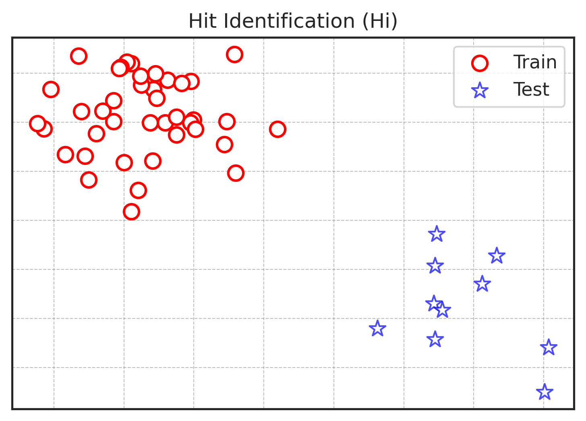
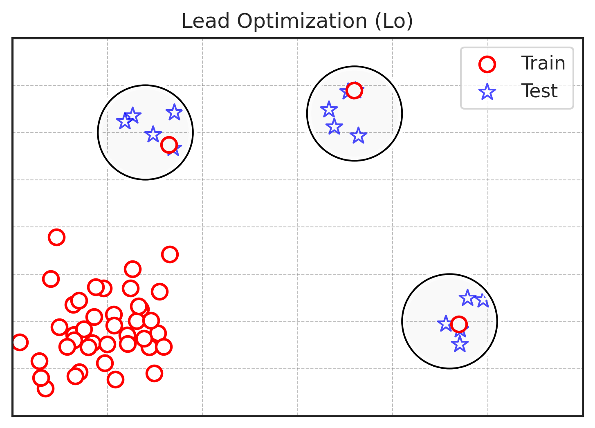

# Lo-Hi Splitter
[](https://www.python.org/downloads/release/python-370/)
[](https://pypi.org/project/lohi-splitter/)

## Description
There are two distinct tasks in drug discovery: Lead optimization (Lo) and Hit identification (Hi). The Lo-Hi Splitter enables users to partition molecular datasets based on these tasks and helps choose the most appropriate models. There is a NeurIPS2023 Dataset and Benchmarks paper related to this repository: https://arxiv.org/abs/2310.06399

### Hit Identification
The objective of the Hit Identification task is to discover new molecules with a desired property that are distinct from molecules with known activity. The Hi splitter divides the dataset into training and test sets such that no molecule in the test set resembles any molecule in the training set based on ECFP4 Tanimoto similarity. In some instances, an exact split might not be achievable, resulting in the discarding of certain molecules. To reduce the number of discarded molecules, the Hi splitter employs the minimal vertex k-cut method.



This split predicts experimental outcomes better for the Hi-scenario, and might lead to improved performance. See Appendix F of the paper:

| Dataset                  | Validation | Test  |
|--------------------------|------------|-------|
| DRD2-Hi (Hi Split)       | 0.603      | **0.677** |
| DRD2-Hi (Scaffold Split) | 0.872      | 0.663 |
| HIV-Hi (Hi Split)        | 0.069      | **0.084** |
| HIV-Hi (Scaffold Split)  | 0.189      | 0.078 |

### Lead Optimization

The goal of the Lead Optimization task is to predict how minor modifications of a molecule affect its properties. The Lo splitter divides the dataset into training and test sets in such a way that:
1) The test set consists of clusters of similar molecules.
2) Clusters have a variation of the property larger than the experimental noise.
3) In each test cluster, exactly one molecule is moved to train to imitate a known hit.
This scenario imitates goal-directed optimization tasks in generative models, which employ a predictive model to guide the optimization.



## Installation
You need python >= 3.7.
### From pip
```
pip install lohi_splitter
```
Done.


### From Source
```
git clone git@github.com:SteshinSS/lohi_splitter.git
cd lohi_splitter
python -m pip install --upgrade pip build
python -m build
pip install dist/lohi_splitter-1.0-py3-none-any.whl 
```
Done.

## Tutorial
Here are some quick tutorials to help you get started. To run the notebooks located in `tutorial/`, install additional packages:
```
pip install -r requirements.in
```

1) `00_hi_split_quick.ipynb` - A brief introduction to the Hi split. ([colab](https://colab.research.google.com/drive/10N8QoOXRe2eIFzjNozcgZJh5X4FPu7ql?usp=sharing))
2) `01_hi_split_coarsening.ipynb` - How to accelerate the Hi splitter. ([colab](https://colab.research.google.com/drive/1kUqMT24m7XLa8HZ_E6vHA8Vs54DgiZKW?usp=sharing))
3) `02_lo_split.ipynb` - A brief introduction to the Lo split. ([colab](https://colab.research.google.com/drive/1C2Ji5ipjKxp8AXR7EgHdOosyqDiZSLTL?usp=sharing))
4) `03_hi_under_the_hood.ipynb` - Delving into the details of the Hi splitter implementation. ([colab](https://colab.research.google.com/drive/1Aaik_UyW7VyjYs-kXHM4Fbmom-Bu-ctt?usp=sharing))


## Usage
Import the library:
```
import lohi_splitter as lohi
```

Hi Splitter, train-test:
```
smiles = ['C', 'CCC', 'CCCCC']

# Note that train_min_frac and test_min_frac are less than 1.0.
# It is made to allow solutions that discard some molecules.
train_test_partition = lohi.hi_train_test_split(smiles=smiles, 
                                     similarity_threshold=0.4, 
                                     train_min_frac=0.7, 
                                     test_min_frac=0.1)                                    
```
Hi Splitter, k-fold:
```
k_fold_partition = lohi.hi_k_fold_split(smiles=smiles, 
                                        similarity_threshold=0.4, 
                                        k=3)
```

Hi Splitter, faster, but more discarded molecules:
```
partition = lohi.hi_train_test_split(smiles=smiles,
                                     similarity_threshold=0.4,
                                     train_min_frac=0.65,
                                     test_min_frac=0.1,
                                     coarsening_threshold=0.4,
                                     max_mip_gap=0.3)
```

Lo Splitter:
```
smiles = ['C', 'CCC', 'CCCCC']
values = [0.3, 0.6, 0.1]

cluster_smiles, train_smiles = lohi.lo_train_test_split(smiles=smiles, 
                                                        threshold=0.4, 
                                                        min_cluster_size=5, 
                                                        max_clusters=50, 
                                                        values=values, 
                                                        std_threshold=0.60)
```

## Docs

Description of arguments
```
def hi_train_test_split(
    smiles,
    similarity_threshold=0.4,
    train_min_frac=0.7,
    test_min_frac=0.1,
    coarsening_threshold=None,
    verbose=True,
    max_mip_gap=0.1,
):
    """
    Splits a list of smiles into train and test sets such that no molecule in the test
    has ECFP4 Tanimoto similarity to the train > similarity_threshold.

    Parameters:
        smiles -- List of smiles to split.
        similarity_threshold -- ECFP4 Tanimoto threshold. Molecules in the test set won't
            have a similarity greater than similarity_threshold to those in the train set.
        train_min_frac -- Minimum fraction for the train set, e.g., 0.7 of the entire dataset.
        test_min_frac -- Minimum fraction for the test set, e.g., 0.1 of the entire dataset.
            It's possible that the k-cut might not be feasible without discarding some molecules,
            so ensure that the sum of train_min_frac and test_min_frac is less than 1.0.
        coarsening_threshold -- Molecules with a similarity greater than the coarsening_threshold will be
            clustered together. It speeds up execution, but makes the solution less optimal.
                None -- Disables clustering (default value).
                1.0 -- Won't do anything
                0.90 -- will cluster molecules with similarity > 0.90 together
        verbose -- If set to False, suppresses status messages.
        max_mip_gap -- Determines when to halt optimization based on proximity to the optimal solution.
            For example, setting it to 0.5 yields a faster but less optimal solution, while 0.01 aims for a more
            optimal solution, potentially at the cost of more computation time. See more in MIP Python documentation.

    Returns:
        partitions - list of two lists. The first contains indices of train smiles, and the second contains indices of test smiles.
    """


def hi_k_fold_split(
    smiles,
    similarity_threshold=0.4,
    fold_min_frac=None,
    k=3,
    coarsening_threshold=None,
    verbose=True,
    max_mip_gap=0.1,
):
    """
    Splits the list of smiles into k folds such that no molecule in any fold has an ECFP4 Tanimoto
    similarity greater than similarity_threshold when compared to molecules in another fold.

    Parameters:
        smiles -- List of smiles to split
        similarity_threshold -- ECFP4 Tanimoto threshold. Molecules in one fold won't
            have a similarity greater than similarity_threshold to those in another fold.
        fold_min_frac -- Minimum fraction of a fold (e.g., 0.2 of the entire dataset).
            If not specified (None), it defaults to 0.9 / k.
        k -- number of folds
        coarsening_threshold -- Molecules with a similarity greater than the coarsening_threshold will be
            clustered together. It speeds up execution, but makes the solution less optimal.
                None -- Disables clustering (default value).
                1.0 -- Won't do anything
                0.90 -- will cluster molecules with similarity > 0.90 together
        verbose -- If set to False, suppresses status messages.
        max_mip_gap -- Determines when to halt optimization based on proximity to the optimal solution.
            For example, setting it to 0.5 yields a faster but less optimal solution, while 0.01 aims for a more
            optimal solution, potentially at the cost of more computation time. See more in MIP Python documentation.

    Returns:
        partitions - list of lists. Each list contains the indices of smiles in that fold.
    """

def lo_train_test_split(
    smiles, threshold, min_cluster_size, max_clusters, values, std_threshold
):
    """
    Lo splitter. Refer to tutorial 02_lo_split.ipynb and the paper by Simon Steshin titled "Lo-Hi: Practical ML Drug Discovery Benchmark", 2023.

    Parameters:
        smiles -- list of smiles
        threshold --  molecules with similarity larger than this number are considered similar
        min_cluster_size -- number of molecules per cluster
        max_clusters -- maximum number of selected clusters. The remaining molecules go to the training set.
        values -- values of the smiles
        std_threshold -- Lower bound of the acceptable standard deviation for a cluster. It should be greater than measurement noise.
                         If you're using ChEMBL-like data, set it to 0.60 for logKi and 0.70 for logIC50.
                         Set it lower if you have a high-quality dataset. Refer to the paper, Appendix B.

    Returns:
        clusters -- list of lists of smiles.
        train_smiles -- list of train smiles
    """
```

## FAQ

**Isn't a scaffold split sufficient?**

A scaffold split often leads to a considerable number of highly similar molecules between the training and testing sets. Refer to tutorial/00_hi_split_quick.ipynb for examples.

**How do I choose the appropriate similarity threshold?**

Your selection will depend on the desired generality of your model. Many prefer a 0.40 ECFP4 Tanimoto similarity threshold. For a detailed answer, consult the associated paper, specifically chapter "3. Novelty."

**How should I determine the std_threshold for the Lo splitter?**

The threshold choice is contingent on the noise level in your data. For ChEMBL-like data, consider using 0.70 for pIC50 and 0.60 for pKi. For high-quality in-house datasets, a threshold of 0.20 for pIC50 might suffice. For a comprehensive answer, refer to the associated paper, specifically Appendix B titled "Lo dataset is not just noise."

**I have M1 MacBook Pro**
Congratulations! However, the library might not function as expected. We utilize the MIP python library, which in turn relies on the CBC library to solve linear problems. If you encounter an error like `NameError: name 'cbclib' is not defined`, then try [this](https://github.com/coin-or/python-mip/issues/199). The author does not have a Mac, so he cannot test the solution. If you need access to the MIP, refer to Tutorial #4, which demonstrates how the Lo-Hi splitter uses the MIP library behind the scenes.

## Development

### Development environment
We use flake8 for linting and black for code formatting.

```
conda create --name lohi_splitter_dev python=3.7
conda activate lohi_splitter_dev
python -m pip install --upgrade pip build
python -m build
pip install dist/lohi_splitter-1.0-py3-none-any.whl 
pip install -r requirements.in 
```

### Contribution
You can contribute in several ways:

1) Unit Tests: The library is compact and will not expand significantly. Thus, select the simplest framework possible.
2) General Interface: The concept behind Hi Splitter can be applied to various object types, such as amino acid sequences or images. It might be beneficial to have a general interface that works with neighborhood graphs. However, this requires expertise and an understanding of other fields. If you have ideas on how Hi Splitter can be applied to your non-molecular data, please open an issue to discuss it.

## Citation
```
@inproceedings{steshin2023hi,
  title={Lo-Hi: Practical ML Drug Discovery Benchmark},
  author={Steshin, Simon},
  booktitle={Thirty-seventh Conference on Neural Information Processing Systems Datasets and Benchmarks Track},
  year={2023}
}
```